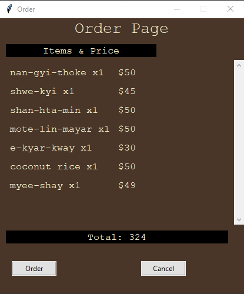
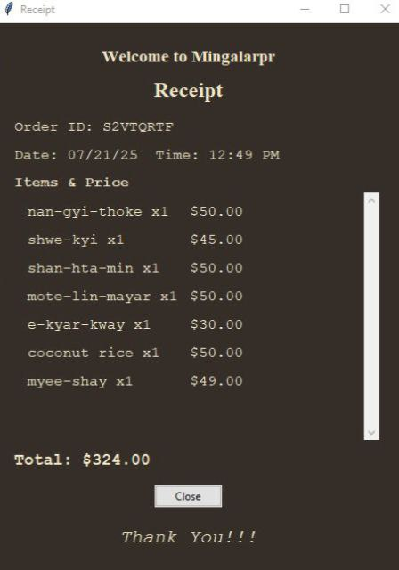

# 🍽️ Restaurant Ordering System

## 📝 Project Overview
This project is a **restaurant ordering system** developed using **Python** and **Tkinter**, designed to help restaurant staff efficiently take customer orders, calculate totals, and process payments through a **user-friendly graphical interface**.

The system simulates a real-life ordering process with a smooth multi-screen layout, food image previews, and dynamic order tracking for an enhanced user experience.

---

## 💡 Key Features

- 📋 **Menu & Beverage Display**  
  A categorized menu interface that lists food and beverage items. Selecting a dish shows its image beside the menu.

- ➕➖ **Add/Remove Items**  
  Users can add items using the **“Add to Order”** button or remove items using the **“Remove”** button.

- 🧾 **Order Summary Screen**  
  Displays added items with individual prices. The total cost updates dynamically as users add or remove items.

- ✅ **Order Confirmation & Cancellation**  
  Users can:  
  - Click **“Order”** to confirm the order.  
  - Click **“Cancel”** to reset and discard the current order.

- 🧾 **Receipt Generation**  
  Once an order is confirmed, a **receipt screen** appears showing:  
  - Date and time of purchase  
  - Ordered items with individual prices  
  - Total amount due

---

## 🛠️ Technologies Used

- **Language**: Python 3.x  
- **GUI Framework**: Tkinter  
- **Image Handling**: PIL (Pillow)  
- **Date & Time**: `datetime` module

---

## 🖼️ Screenshots

### Home Screen

###  Order Screen

###  Receipt Screen

---

## Application Structure

1. **Menu Screen**
   - Food and beverage list  
   - Image preview on dish selection  
   - Buttons to add or remove items

2. **Order Screen**
   - Displays items currently in the order  
   - Automatically updates total cost  
   - “Order” and “Cancel” buttons for next steps

3. **Receipt Screen**
   - Shows detailed receipt with:  
     - Timestamp  
     - Itemized costs  
     - Total price

---

## 📌 Goals

- Provide an intuitive and responsive GUI for restaurant staff  
- Use object-oriented design for clean and modular code  
- Mimic a real-world ordering flow with visual feedback  
- Handle edge cases like empty orders or invalid item removal  

---

